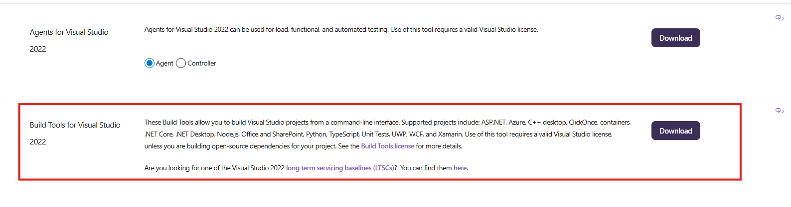
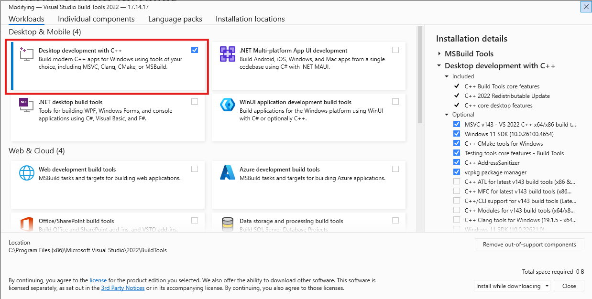

Installation
=============================

Dependencies
------------

MolSanitizer is built upon the following packages:

- RDKit 2024.09.3+ (`Reference <https://www.rdkit.org/docs/Install.html>`__)

- OpenBabel 3.1.1 (`Reference <https://openbabel.org/docs/dev/Installation/install.html>`__)

- Mol2DB2 (`Reference <https://github.com/ryancoleman/mol2db2>`__)

- AMSOL 7.1 (`Reference <https://comp.chem.umn.edu/sds/>`__)

By default, conda will install all the dependencies, except for AMSOL, which is required for the generation of DB2 files. The user is asked to download and compille the source code from the `official website <https://comp.chem.umn.edu/sds/>`_. Instruction on how to compile on modern systems is provided in the MolSanitizer/amsol directory.

For the early evaluation, the compiled version of AMSOL is provided in the MolSanitizer directory.

Installation
------------

We will set up the environment using `Anaconda <https://docs.anaconda.com/anaconda/install/index.html>`_.

.. code-block:: console

   $ git clone https://github.com/phonglam3103/MolSanitizer.git
    

Mac OS and Linux
^^^^^^^^^^^^^^^^^^^^^^^^^^^

For UNIX-based systems (Mac OS and Linux), the installation and building process could be done quite straightforwardly. In the same folder as previous steps, use:

.. code-block:: console
   
   $ conda env create -f MolSanitizer/environment.yml
   $ conda activate msani
   $ pip install -e MolSanitizer

Windows
^^^^^^^^^^^^^^^^^^^^^^^^^^^

The installation in Windows requires the installation of Microsoft Visual Studio (VS) with C++ build tools, which can be downloaded from `here <https://visualstudio.microsoft.com/downloads/?cid=learn-onpage-download-install-visual-studio-page-cta>`_. Scroll down and only Download the option "Build Tools for Visual Studio 2022".

Then, during the installation, make sure to select the "Desktop development with C++" workload, as shown below:

After installing Visual Studio, you can proceed with the installation of MolSanitizer. In the same folder as previous steps, use:

.. code-block:: console

   $ conda env create -f MolSanitizer/environment.yml
   $ conda activate msani
   $ pip install -e MolSanitizer

Testing
-------

MolSanitizer uses `unittest <https://docs.python.org/3/library/unittest.html>`_ for testing. To run the tests, use the following command:

In the same folder as previous steps, use:

.. code-block:: console

   $ python -m unittest MolSanitizer/test/test_msani.py

The test takes around 1-2 minutes to complete.
