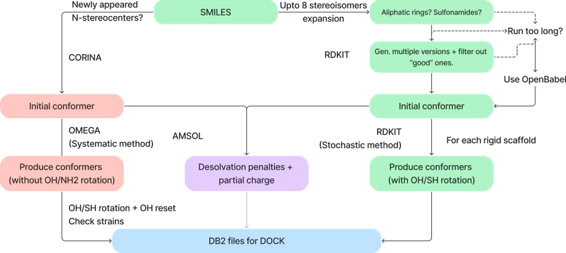

Theory
######

SMARTS Matching and Reactions
******************************

EirVS uses SMARTS matching and reactions for matching the substructures in its pipeline. The user is encouraged to refer to the Daylight's Documentation on SMARTS for detailed information [1]_.

SMARTS Matching and Reactions in EirVS
================

EirVS leverages the power of SMARTS matching and reactions to automate the preparation and filtering of molecular datasets for drug discovery. Below are the key applications:

1. **Tautomer Standardization**:

   - EirVS employs a two-step approach to tautomer standardization, combining RDKit's tautomer canonicalization functionality with SMARTS reactions for enhanced refinement. Initially, RDKit's canonicalization function generates the base set of tautomers. These are then further refined using SMARTS reactions to ensure the selection of the most chemically stable and biologically relevant tautomer.

   - Since 2020, RDKit has implemnted the MolVS project to its codebase, which includes a tautomer enumeration, and tautomer canonicalizer [2]_ . It is important to note that the scoring function used in RDKit doesn't try to predict the most stable tautomer, but rather tries to predict the same output given different tautomers (canonicalize). Therefore, EirVS applies another layer of correction to get the most stable tautomer, according to the literature. The SMARTS reaction library for tautomer is available in `EirVS/Data/tautomers.txt <https://github.com/phonglam3103/EirVS/blob/main/EirVS/Data/tautomers.txt>`_.

2. **PAINS and Unwanted Substructure Filtering**:

   - SMARTS enables the identification of undesirable substructures like PAINS (Pan Assay Interference Compounds) [3]_ and reactive functional groups. Custom SMARTS patterns allow users to extend or modify filtering rules to suit specific project requirements.

3. **Protonation**:

   - Protonation states are assigned iteratively using SMARTS-based rules for ionizable groups. This ensures molecules are prepared for pH-specific environments, with expanded outputs for cases of multiple possible states. The program uses SMARTS reactions to iteratively assign the protonation stages to the atoms. The SMARTS reactions can be obtained from `EirVS/Data/ionizations.txt <https://github.com/phonglam3103/EirVS/blob/main/EirVS/Data/ionizations.txt>`_. If there are multiple possibilities of protonation, the output will be expanded.

4. **Matching Rigid Scaffolds and Invertable Chiral Centers**:

   - EirVS uses SMARTS to detect substructures such as rings and aromatic nitrogen to correct geometry due to systematic errors of MMFF94s. SMARTS matching is also the foundation for dihedral matching of the molecules to the Torsional Library [4]_, [5]_, [6]_ , which drives conformational sampling for docking.

For more detailed usage and examples, refer to the :doc:`usage` section.

Conformational Sampling
***********************

EirVS utilizes a stochastic conformational sampling approach to generate diverse and representative conformers for molecular structures. Unlike the current DB2 pipeline, which samples all possible conformations with discrete increments, EirVS focuses on sampling only the favorable regions defined by the Torsional Library.

Torsional Library (or TorLib) [4]_, [5]_, [6]_ is a collection of expert-derived SMARTS rules that define preferred torsion angles for small molecules. By matching molecular structures to TorLib, EirVS concentrates on sampling conformations that are more likely to be biologically relevant. This targeted approach reduces computational overhead while ensuring the generation of meaningful conformers. The workflow of the conformational sampling process is illustrated in the figure below.

----

The first step involves generating an initial conformer using the srETKDGv3 (small-ring ETKDGv3) algorithm of RDKit [7]_. However, this algorithm can sometimes produce unfavorable ring conformations such as "boat" or "twist" forms. To address this, EirVS generates up to 100 conformers and filters out the undesirable ones using a curated library of preferred ring conformations. Currently, EirVS supports rings up to eight members in size. At the end of the initial embedding process, only the lowest-energy conformer with favorable ring conformations is used for subsequent conformational sampling. In cases where RDKit fails or exceeds a time limit (default: 2 minutes), the embedding method of OpenBabel is used as a backup [8]_.

As recommended by the RDKit developers, the initial conformer is minimized using a force field—in this case, the MMFF94s force field [9]_. However, the minimized conformer may still exhibit systematic errors inherent to such force fields, such as non-planarity of aromatic nitrogens. EirVS addresses these issues by using SMARTS patterns to detect and correct these substructures, ensuring accurate molecular geometries. This initial conformer also serves as the input for desolvation penalty calculations using AMSOL.

The second step is the conformational sampling based on TorLib. TorLib provides 513 rules, ranging from the most specific to the most general, allowing it to match any rotatable bond. During conformational sampling, hydroxyl groups (-OH) are allowed to rotate, eliminating the need for -reseth or -rotateh steps in the Mol2DB2 process. Dihedrals that involved in symmetric substituents such as (-CH3, -CF3, -C6H5,...) are rescaled to avoid the oversampling of similar conformations. The pseudocode explaining the conformational sampling algorithm is shown below:

.. code-block:: python

    def stochastic_sampling(conf, rot_bonds, tolerance, max_confs, max_attempts, e_window):
        num_confs = 0
        attempts = 0
        product = []
        min_energy = 1e6  # Initialize min_energy if needed

        while num_confs < max_confs and attempts < max_attempts:
            Select a random torsion t
            Select a random peak p from Torlib
            Select a random angle θ within peak p considering tolerance
            Rotate dihedral t to angle θ

            if has_clashes(conf):
                attempts += 1
                continue

            # Calculate energy of the conformer
            energy = calculate_energy(conf)

            # Update min_energy if this is the first conformer or a lower energy is found
            if energy < min_energy:
                min_energy = energy

            if energy <= min_energy + e_window:
                add conf to product
                num_confs += 1

        return product

After the conformational sampling, the generated conformers undergo energy window filtering, typically set to 25 kcal/mol by default. The lowest-energy conformer sampled so far is chosen as the reference energy. Conformers within the energy window relative to the reference energy are retained, while the rest are discarded. Finally, the Mol2DB2.py software is used to convert the conformers into the DB2 format required for DOCK3.8, preparing them for docking.

References
==========

.. [1] Daylight Chemical Information Systems, Inc., "SMARTS - A Language for Describing Molecular Patterns", available at: https://www.daylight.com/dayhtml/doc/theory/theory.smarts.html
.. [2] Greg Landrum, Trying out the new tautomer canonicalization code. https://greglandrum.github.io/rdkit-blog/posts/2020-01-25-trying-the-tautomer-canonicalization-code.html
.. [3] Baell, J. B., & Holloway, G. A. (2010). New substructure filters for removal of pan assay interference compounds (PAINS) from screening libraries and for their exclusion in bioassays. Journal of medicinal chemistry, 53(7), 2719-2740. Available at: https://pubs.acs.org/doi/10.1021/jm901137j
.. [4] Scharfer, C., Schulz-Gasch, T., Ehrlich, H. C., Guba, W., Rarey, M., & Stahl, M. (2013). Torsion angle preferences in druglike chemical space: a comprehensive guide. Journal of Medicinal Chemistry, 56(5), 2016-2028. Available at: https://pubs.acs.org/doi/10.1021/jm3016816
.. [5] Guba, W., Meyder, A., Rarey, M., & Hert, J. (2016). Torsion library reloaded: a new version of expert-derived SMARTS rules for assessing conformations of small molecules. Journal of chemical information and modeling, 56(1), 1-5. Available at: https://pubs.acs.org/doi/10.1021/acs.jcim.5b00522
.. [6] Penner, P., Guba, W., Schmidt, R., Meyder, A., Stahl, M., & Rarey, M. (2022). The torsion library: Semiautomated improvement of torsion rules with SMARTScompare. Journal of Chemical Information and Modeling, 62(7), 1644-1653. Available at: https://pubs.acs.org/doi/10.1021/acs.jcim.2c00043
.. [7] Wang, S., Witek, J., Landrum, G. A., & Riniker, S. (2020). Improving conformer generation for small rings and macrocycles based on distance geometry and experimental torsional-angle preferences. Journal of chemical information and modeling, 60(4), 2044-2058. Available at: https://pubs.acs.org/doi/10.1021/acs.jcim.0c00025
.. [8] Yoshikawa, N., & Hutchison, G. R. (2019). Fast, efficient fragment-based coordinate generation for Open Babel. Journal of cheminformatics, 11(1), 49. Available at: https://jcheminf.biomedcentral.com/articles/10.1186/s13321-019-0372-5
.. [9] Tosco, P., Stiefl, N., & Landrum, G. (2014). Bringing the MMFF force field to the RDKit: implementation and validation. Journal of cheminformatics, 6, 1-4. Available at: https://jcheminf.biomedcentral.com/articles/10.1186/s13321-014-0037-3