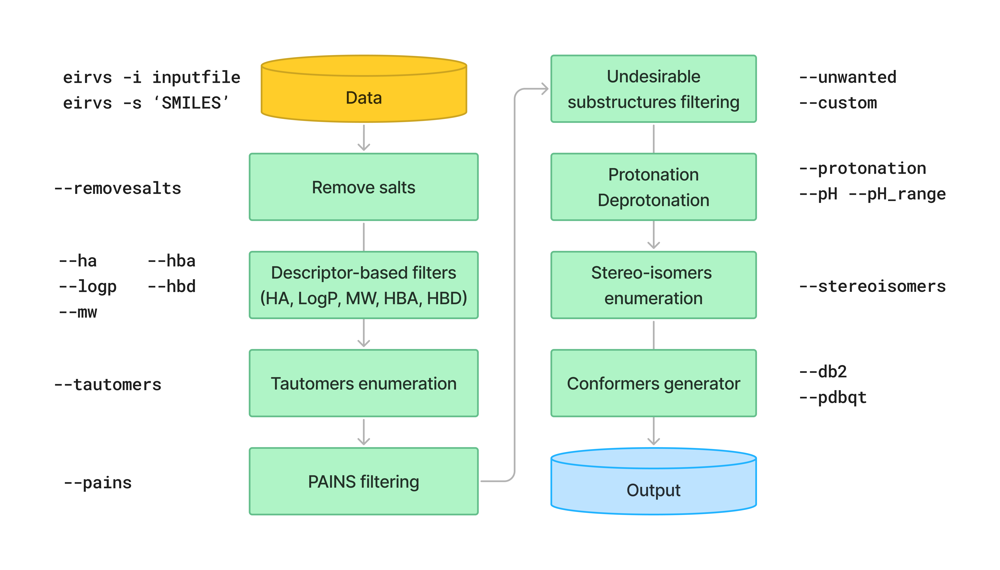

Usage
#####

Preparing the input file
************************

The program requires a white-space or tab-delimited file containing two columns (SMILES, moleculeID) without headers. 

.. code-block:: console
   
   COCCC(=O)Nc1ncc(s1)Br  CP000000418470
   C1CC(C(=O)NC1)SCCC=CBr  CP000000432409
   CC(C)(C)CNC(=O)c1ccsc1Br  CP000001634597
   c1c(coc1Br)C(=O)NC2CCSC2  CP000001645677
   c1c(c([nH]n1)C(=O)NCC2(CC2)N)Br  CP000001647414

Extended SMILES is supported (by the `-e` or `--extended` flag, but the database needs to be tab-separated.

.. code-block:: console
    CC[C@H]1[C@H](C(=O)N[C@H](C)CCCC(=O)NOCC(F)(F)F)CCN1C |&1:2,3|	Cmp0001
    CCC(CC(=O)N(CC)CCC(=O)N1CCO[C@H]2COC[C@H]21)C(F)F |&1:17,21|	Cmp0002
    CC(C)CC(CNC(=O)C1CSC1)C(=O)N[C@H]1C[C@@H](O)[C@H](F)C1 |&1:16,18,20|	Cmp0003

Overview
************************

The pipeline contains six preparation and/or filtering steps, which can be used simultaneously to prepare the database:

This is an example of a lazy pipeline that uses all the preparation and processing steps:

.. code-block:: console

    $ msani -i example.smi --enamine --lazy  # For enamine format
    $ msani -i example.smi --lazy

    # This is equivalent to:
    # msani -i example.smi --removesalts --tautomers --pains --unwanted all --stereoisomers --protonation

By default, the program produces a new file with a **_clean** suffix. If the PAINS or unwanted filters are applied, the rejected molecules with the reason for rejection will be output with a **_rejected** suffix.

The program by default will conduct the preparation and filtering in the order below:

Setting configurations
**********************

Many of the default values of msani described below, both in the SINGLE MODE and BATCH MODE can be modified in `msani/msani_configurations.yaml <https://github.com/phonglam3103/msani/blob/main/msani_configurations.yaml>`_ file. It is for the convenience of the  user so that he/she does not have to specify the values (such as numConfs, --max_stereoisomers, etc) every time the program is run. If the user specify the values in the command line, the values in the configuration file will be overwritten.

The users are asked to provide CORINA path if the he/she wants to use it for the generation of 3D coordinates. The path should be provided in the `CORINA` field.

Below is the default configuration file:

.. code-block:: yaml
    
    #===============SINGLE MODE================
    EMBED_METHOD: 'rdkit' # choose from 'rdkit', 'obabel', 'corina'
    CORINA: '/proj/carlssonlab/corina/corina-4.2/corina'
    ENERGY_WINDOW: 25
    NUMCONFS: 2000
    MAX_STEREOISOMERS: 8
    TIMEOUT: 2
    PH: 7
    PH_RANGE: 0 # 0 means choose specific pH=7 (default), 2 means will sample pH 5 and 9

    #================BATCH MODE=================
    SLURM_ACCOUNT: 'naiss2024-3-45'
    LINES_PER_JOB: 200
    TIME_LIMIT: 96
    MAX_ARRAY_SIZE: 2000
    MAX_JOBS: 1000
    MAX_LIMIT_PROJECT: 5000

Reproducible setup by the configuration file
***************************************

The program can be run with the configuration file by using the ``--config`` flag. The path to the configuration file should be provided. Refer to the :doc:`config` section for more details on the configuration file.

Help message
************

**Use the** ``--help (-h)`` **flag for more information.**

.. code-block:: console

    usage: msani [--input_files INPUT_FILES [INPUT_FILES ...]] [--smiles SMILES [SMILES ...]] [--extended]
             [--prefix PREFIX] [--synthon] [--removesalts] [--create_custom] [--custom CUSTOM] 
             [--unwanted [{all,regular,special,optional} ...]] [--pains] [--ha HA]
             [--logp LOGP] [--hba HBA] [--hbd HBD] [--mw MW] [--chiral CHIRAL] [--tautomers]
             [--stereoisomers] [--max_stereoisomers MAX_STEREOISOMERS] [--protonation] [--pH PH]
             [--pH_range PH_RANGE] [--noneutralize] [--notaurdkit] [--standardize] [--gen3d]
             [--format [{db2,db2.tgz,pdbqt,sdf,mol2} ...]] [--method {rdkit,obabel,corina}]
             [--numconfs NUMCONFS] [--randomSeed RANDOMSEED] [--timeout TIMEOUT]
             [--energywindow ENERGYWINDOW] [--rigid RIGID] [--nringconfs NRINGCONFS]
             [--mode {vs,extensive,ignoretorlib}] [--tolerance TOLERANCE] [--nocleanup] [--debug]
             [--lazy] [--numcores NUMCORES] [--help] [--timing] [--version]

    MolSanitizer - A package to prepare SMILES databases

        Ex. input file (space or tab-separated file):
            COCCC(=O)Nc1ncc(s1)Br  CP000000418470
            C1CC(C(=O)NC1)SCCC=CBr  CP000000432409
            CC(C)(C)CNC(=O)c1ccsc1Br  CP000001634597

        Ex. run
        msani -i example.smi --removesalts --pains --unwanted all --stereoisomers --protonation
        msani -i example.smi --pdbqt --logp "<=500" --hba "<=10" --hbd "<=5" --mw "<=500"
        msani -i example.smi --pains --unwanted regular optional --stereoisomers --protonation
        msani -i example.smi --pains --unwanted all --protonation -p 7 -r 1 --tautomers --stereoisomers --gen3d -f db2.tgz
        

    Input and output options:
    --input_files, -i     Input files containing chemical structures
    --smiles, -s          Input SMILES strings
    --extended, -e        Extended SMILES reading (tab-separated files supported only) (default: False)
    --prefix, -pre        Prefix for the output files. (defalt: input file name).
    --synthon, -stn       Synthon mode (Additional metadata about the capping groups required)

    Filtering options:
    Supported formats for descriptor-based filters (ha, logp, hba, hbd, mw, chiral):
        Range: Specify a range using two values (e.g., "17-25").
        Greater / Less than or equal to: Use >= or <= (e.g., ">=17", "<=25").
        Greater than / Less than: Use > or < (e.g., ">17", "<25").
        Exact match: Match a specific value (e.g., 17).
        For logP, the exact match format applies as 'less than or equal to'.
        
        Use --ha, --logp, --hba, --hbd, --mw, --chiral to apply these filters.

    --removesalts         Remove salts from the structures.
                            Small fragments within the same molecule are also removed.
    --create_custom       Generate a template for customized substructure filtering.
    --custom              Filter out unwanted substructures using a customized list.
                            To generate an example list, use --create_custom.
    --unwanted            Filter out unwanted substructures using the default list
                            (Options: all, regular, special, optional).
    --pains               Remove PAINS violations from the structures.

    SMILES processing options:
    --tautomers, -tau     Tautomers enumeration
    --stereoisomers, -ste Stereoisomers enumeration (only consider unspecified chiral centers)
    --max_stereoisomers, -ms
                          Maximum number of stereoisomers to consider (default: 8
    --protonation, -prot  Apply protonation to the structures
    --pH, -p              pH for the protonation (default: 7)
    --pH_range, -r        pH range for the protonation (default: 0)
    --standardize, -std   Standardize structures for machine learning using RDKit

    Generate 3D conformers options:
    --gen3d, -3d          Generate 3D conformers
    --format, -f          Output file format. Multiple formats simultaneously supported.
                            (Default: db2.tgz - Options: sdf, db2, db2.tgz, mol2, pdbqt.)
    --method, -m          Embedding method (default: rdkit - options: rdkit, obabel, corina)
    --numconfs, -nconfs   Maximum number of conformers to generate (default: 2000)
    --timeout, -to        Timeout for the initial embedding for each SMILES entry before using OpenBabel
                            Default: 2 minutes
    --energywindow, -w    Energy window for sampling the conformations (default: 25 kcal/mol)
    --nringconfs, -nr     Maximum number of ring conformers to generate (default: 1)
    --mode, -mode         Mode for generating conformers
                            Default: fixed - Options: fixed, random, ignoretorlib
    --allowNonring        Allow the full sampling of non-ring compounds (default undersample to 30 confs).

    Miscellaneous:
    --lazy                Implement all the processing and preparation steps
    --numcores, -j        Number of cores to use for parallel processing (default: 4)
    --help, -h            Show this help message and exit
    --help_advanced, -xh  Show advanced help message with additional options
    --version, -v         Show the current version of MolSanitizer

Available filters and preparation steps
***************************************

1. Remove salts
============

To use the remove salts function, simply use the ``--removesalts`` flag. The program uses a predefined salt list in `msani/Data/salt_stripping.txt <https://github.com/phonglam3103/msani/blob/main/msani/Data/salt_stripping.txt>`_ to remove the salts, which contain both organic and inorganic salts commonly used in medicinal chemistry. Since the 0.2.3 version, Salt Remover will also remove the smaller fragments in the same molecule entry and only retain the largest one.

*Caution:* If the entry is an organic salt (e.g., sodium acetate CH\ :sub:`3` COO\ :sup:`-` Na\ :sup:`+`), the whole entry will be removed.

.. code-block:: console

    $ msani -i example.smi --removesalts

2. Tautomers enumeration
============================

The tautomers could be generated using the ``--tautomers`` flag. msani uses a two-step approach for the enumeration of tautomers. First, the canonical tautomer from the scoring function of ``rdMolStandardize.TautomerEnumerator`` is used. Then, the exceptions are corrected using the expert-curated SMARTS rules. The SMARTS rules are readily accessible at `msani/Data/tautomers.txt <https://github.com/phonglam3103/msani/blob/main/msani/Data/tautomers.txt>`_.

.. code-block:: console

    $ msani -i example.smi --tautomers

3. Descriptor-based filtering
============================

The following descriptors are supported for filtering: heavy atoms (HA), logP, hydrogen bond acceptors (HBA), hydrogen bond donors (HBD), molecular weight (MW), and number chiral centers. The descriptors can be filtered using the following flags:
``--ha``, ``--logp``, ``--hba``, ``--hbd``, ``--mw``, and ``--chiral``. The filtering can be done using the following formats:

* Range: Specify a range using two values (e.g., "17-25").
* Greater / Less than or equal to: Use >= or <= (e.g., ">=17", "<=25").
* Greater than / Less than: Use > or < (e.g., ">17", "<25").
* Exact match: Match a specific value (e.g., 17).
* For logP, the exact match format applies as 'less than or equal to'.

For example, to filter the logP values less than or equal to 3.5, use the following command:

.. code-block:: console

    $ msani -i example.smi --logp "<=3.5"

4. PAINS filtering
===============

Molecules that contain PAINS substructures can be efficiently eliminated using the ``--pains`` flag. The violated structures will be stored in the **_rejected** file.

.. code-block:: console

    $ msani -i example.smi --pains

Example of the **_rejected** output is as below:

.. code-block:: text

    CCOc1cccc(C=C2C(=O)N(Cc3ccccc3)C(C)=C2C(=O)OC)c1O Z57339064     "PAINS violation: Ene_five_het_c(85)"
    N#Cc1ccccc1COC(=O)c1cccc2c1C(=O)c1ccccc1C2=O      Z18301252     "PAINS violation: Quinone_a(370)"
    Nc1sc2c(c1C(=O)c1ccccc1)CCC2                      Z1259205366   "PAINS violation: Thiophene_amino_aa(45)"
    COCC1(CC(=O)NCc2cc(O)ccc2O)CC1                    Z2832180283   "PAINS violation: Mannich_a(296)"
    CCCCN(Cc1ccc(OS(=O)(=O)F)cc1)Cc1ccccc1O           Z4607533150   "PAINS violation: Mannich_a(296)"

5. Unwanted substructures filtering
============================

Molecules that contain unwanted substructures can be efficiently eliminated using the ``--unwanted`` flag. msani uses an expert-curated list that contains undesirable substructures, accompanied by the reasons and references for filtering. The list can be obtained from `msani/Data/filter_out.csv <https://github.com/phonglam3103/msani/blob/main/msani/Data/filter_out.csv>`_.

There are four options accompanied by the ``--unwanted`` flag, which are *['all', 'regular', 'special', 'optional']*. If no option is specified, the *regular* filters will be applied. The choice of the options depends on the user and can vary between targets.

.. code-block:: console

    $ msani -i example.smi --unwanted
    $ msani -i example.smi --unwanted regular  # By default
    $ msani -i example.smi --unwanted regular special
    $ msani -i example.smi --unwanted all

It is also possible to filter out customized unwanted substructures, depending on the user's preference, using a customized SMARTS list. To generate a template for this list, use the ``--create_custom`` flag. This will result in the **templates.txt** file.

.. code-block:: console

    $ msani --create_custom

The first two columns (SMARTS and LABEL) are required for the program to parse, while the remaining columns will be omitted by the program. To filter using the customized list, use the ``--custom`` flag with the path to the customized list file. It is also possible to apply both the available filters and the customized filters.

.. code-block:: console

    $ msani -i example.smi --custom templates.txt
    $ msani -i example.smi --unwanted all --custom templates.tsv

6. Protonation
============================

msani supports the assignment of protonation states at various pH values using the ``--protonation`` flag. By default, the pH is set to 7 (configurable via ``-p`` or ``--pH``), and the pH range is set to 0 (specified using ``-r`` or ``--range``). This configuration protonates molecules at a specific pH of 7. However, it is also possible to enumerate potential protonation states across a pH range. For instance, setting ``--range 2`` explores pH values within 7 ± 2. The program evaluates each pH value in the specified range and assigns the possible protonation states of the molecule at those pH levels. Only unique products are output to a file. Functional groups with multiple protonation possibilities (e.g., piperazine, amidine) are expanded, with an underscore (`_`) appended to their names to indicate variations.

The program employs SMARTS-based reactions to iteratively assign protonation states to atoms, considering the pKa of functional groups and the queried pH. Detailed SMARTS reaction definitions are available in the following resource: `msani/Data/ionizations.txt <https://github.com/phonglam3103/msani/blob/main/msani/Data/ionizations_v2.txt>`_.

.. code-block:: console
    $ msani -i example.smi --protonation # Default pH 7 +- 0
    $ msani -i example.smi --protonation --pH 7 --range 2 # Enumerate protonation states at pH 7 +- 2
    $ msani -i example.smi --protonation -p 7 -r 2 # Short version

.. code-block:: text

   Input:
   O=C(N1C(C2C(C1)C2O)C(O)=O)CN3CCNCC3 mol4

   Output:
   O=C([O-])C1C2C(O)C2CN1C(=O)C[NH+]1CCNCC1 mol4_1
   O=C([O-])C1C2C(O)C2CN1C(=O)CN1CC[NH2+]CC1 mol4_2

7. Stereoisomers enumeration
============================

Stereoisomers enumeration will be considered for unspecified chiral centers using the ``--stereoisomers`` flag. For an entry that contains multiple stereoisomers, its ID will be expanded (e.g., mol8 -> mol8.1, mol8.2).

.. code-block:: console

    $ msani -i example.smi --stereoisomers

.. code-block:: text

   Input:
   C1C2CC3CC1CC(C2)(C3O)N                            mol8

   Output:
   N[C@@]12C[C@@H]3C[C@@H](C[C@@H](C3)[C@H]1O)C2     mol8.1
   N[C@@]12C[C@@H]3C[C@@H](C[C@@H](C3)[C@@H]1O)C2    mol8.2

It is possible to define the maximum number of stereoisomers generated for each molecule by adding the ``--max_stereoisomers`` flag.

.. code-block:: console

    $ msani -i example.smi --stereoisomers --max_stereoisomers 32

8. Conformer generator
============================

Basic usage
---------------------------------------

The following supported flags:

.. code-block:: console

    Generate 3D conformers options:
    --gen3d, -3d          Generate 3D conformers
    --format, -f          Output file format. Multiple formats simultaneously supported.
                            (Default: db2.tgz - Options: sdf, db2, db2.tgz, mol2, pdbqt.)
    --method, -m          Embedding method (default: rdkit - options: rdkit, obabel, corina)
    --numconfs, -nconfs   Maximum number of conformers to generate (default: 2000)
    --timeout, -to        Timeout for the initial embedding for each entry before using OpenBabel
                            Default: 2 minutes
    --energywindow, -w    Energy window for sampling the conformations (default: 25 kcal/mol)
    --nringconfs, -nr     Maximum number of ring conformers to generate (default: 1)
    --mode, -mode         Mode for generating conformers
                            Default: fixed - Options: fixed, random, ignoretorlib
    --allowNonring        Allow the full sampling of non-ring comdpounds (default undersample to 30 confs).

The conformer generator platform can be triggered using the ``--gen3d`` or ``-3d`` flag. Three initial embeeder are supported (``-m`` or ``--method`` flag):

* RDKit srETKDG-v3 (default ``-m rdkit``): `Ref <https://pubs.acs.org/doi/10.1021/acs.jcim.0c00025>`_ 
* CORINA (``-m corina``): `Ref <https://doi.org/10.1016/0898-5529(90)90156-3>`_
* Open Babel (``-m obabel``): `Ref <https://jcheminf.biomedcentral.com/articles/10.1186/s13321-019-0372-5>`_ 

Multiple aliphatic ring conformations are supported for RDKit and CORINA with the ``-nr`` flag.

As RDKit ETKDGv3 is based on distance geometry method, it may takes a long time to generate the initial conformer for some large molecules. In this case, the program will opt for the OpenBabel method, after the timeout (default: 2 minutes) is reached. The timeout can be modified using the ``--timeout`` flag. 

A modified version of `TorsionLibrary v3 <https://pubs.acs.org/doi/10.1021/acs.jcim.2c00043>`_ is used to drive the generation of conformations. The modifications made and the full library can be obtained `here <https://github.com/phonglam3103/msani/blob/main/msani/Data/modified_tor_lib_2020.xml>`_. The number of conformers are controlled by the ``--numconfs`` or ``-nconfs`` flag. The default value is 2000, but it can be modified to any number. The program will sample the conformers based on the energy window (default: 25 kcal/mol) using the ``--energywindow`` or ``-w`` flag.

Three sampling modes are supported (``--mode`` or ``-mode`` flag):

* fixed (default): the peaks (with tolerance) in the TorsionLibrary is discretinized into central angles with +-30 degrees offset (as long as they are within the tolernace 2), then combinatorially sampled to generate the conformers until the number of conformers is reached. Symmetric substructures (such as phenyl, carboxylates, etc.) are removed by SMARTS matching in advance.
* random: each peak combination is sampled multiple times. Two conformers are regarded distinct if they differ by at least 30 degrees in any dihedral angle.
* ignoretorlib: the program will ignore the TorsionLibrary and sample every 30 degrees.

Multiple output formats are now supported, including DB2, PDBQT, SDF, and MOL2. The default output format is DB2, which could be modified by the ``--format`` or ``-f`` flag. Multiple formats at the same time is supported.

For DB2 generation, the program employs AMSOL 7.1 for assigning the desolvation penalties and partial charges of the ligand's atoms. Finally, the information from the solvation file and the MOL2 file is aggregated using the `mol2db2.py <https://github.com/ryancoleman/mol2db2>`_ program.

.. code-block:: console

    $ msani -i example.smi --protonation --stereoisomers -3d -f db2  # Generate DB2 files
    $ msani -i example.smi --tautomers --protonation --stereoisomers -3d -f sdf pdbqt #Generate SDF and PDBQT files

Customization of the torsion definition
---------------------------------------

It is possible to add and/or modify the torsion definitions in the TorsionLibrary without modifying the Torlib file by the ``--torsion`` flag. The flag accepts a file which defines multiple SMARTS patterns definining rotatable bonds with the expected dihedral angles. To create a template for the torsion definition file, use the ``--create_torsion`` flag. The template will be saved in the **custom_torsion_templates.txt** file:

.. code-block:: console

    $ msani --create_torsion

The template file will look like this:

.. code-block:: text

    # Template for customized torsion driving
    # Format: Comma separated. Weight is optional, not set = equal weights
    # In case using commas in SMARTS, put it in quotation marks ("text") 
    # SMARTS, possible angle values (sep by space), weight (optional)
    # Example:
    # [O:1]=[C:2]-[N:3][H:4], 180
    # "[O:1]=[C:2]-[N,O,X:3][!H:4]", 0 180
    # [*:1]~[CX4:2]!@[OX2:3]~[*:4], 0 120 240, 1 1 1

To apply the torsion definition file, use the ``--torsion`` flag with the path to the file:

.. code-block:: console

    $ msani -i example.smi --torsion custom_torsion_templates.txt -3d -f db2

Advanced options
*********************

The advanced options can be accessed using the ``--help_advanced`` or ``-xh`` flag. The advanced options are not recommended for general users, but they can be useful for advanced users who want to customize the program's behavior. The following advanced options are available:

.. code-block:: console

    --noneutralize          Do not neutralize the molecule before tautomerization and protonation
    --notaurdkit            Do not use RDKit to canonicalize the tautomeric form of the input SMILES
    --rigid, -r             Only align the DB2 on this rigid scaffold in SMARTS format. All rings if not provided.
    --tolerance, -tol       Minimum angle for differentiating two conformers (default: 30)
    --nringconfs, -nr       Maximum number of ring conformers to generate (default: 1)
    --allowNonring          Allow the full sampling of non-ring compounds (default undersample to 30 confs).
    --eps                   The dielectric constant for electrostatic calculations (default: 1 - vacuum).
    --debug                 Enable debug mode
    --timing                Enable timing information
    --create_protlib      Create a template for customized protonation scheme
    --create_taulib       Create a template for customized tautomerization scheme
    --create_torsion      Create a template for customized torsion definition
    --protlib             Path to the protonation library file (default: msani/Data/ionizations_v3.txt).
    --taulib              Path to the tautomer library file (default:  msani/Data/tautomers_v3.txt).
    --torsion, -tor       Path to the customized torsion definitions.

Running in batch mode
*********************

msani now supports the batch mode ``msani_batch``, which allows handling bigger SMILES databases on the SLURM-based cluster. Nearly all the flags supported by the standalone msani are supported by the batch mode. In principle, ``msani_batch`` will split the input file into chunks of smaller input files, which is defined by the ``-l`` or ``--lines_per_job`` flag (default: 200). The split files will then be submitted to the SLURM cluster using an array of jobs. By default, a maximum of 500 jobs will be submitted simultaneously to avoid interfering with other users within the same project, but you can change this limit with the ``--max_jobs`` flag.

The additional flags supported by ``msani_batch`` so far:

.. code-block:: console

    --projectName, -A           The account that will be charged by the SLURM cluster for running tasks (default: naiss2024-3-45)
    --lines_per_job, -l         Number of lines to process per job (default: 200)
    --timelimit, -tl            Time limit in hours for each SLURM job (default: 96)
    --max_jobs, -mj             Maximum number of jobs to run simultaneously (default: 500)

Usage
=====

.. code-block:: console

    $ msani_batch -i example.smi -l 50 -3d -f db2
    $ msani_batch -i example.smi -l 50 --stereosiomers --protonation -3d -f db2 --nocleanup
    $ msani_batch -i example.smi -l 50 -A snic2021-3-32 -tl 2 -3d -f db2

It is also possible to submit the batch jobs for multiple input files. The program will automatically detect the input files and submit the jobs accordingly.

.. code-block:: console

    $ msani_batch -i example.smi example2.smi -3d -f db2 --protonation --stereoisomers

