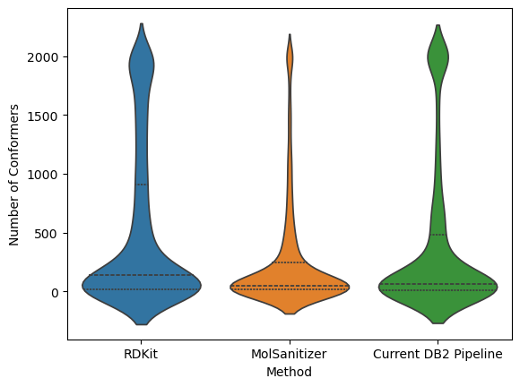
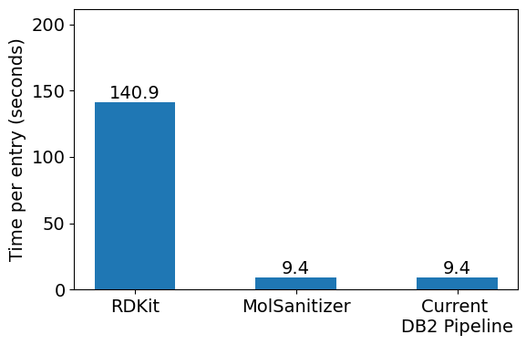

Validation
========
.. _validation:

Validation of the conformational generation part of MolSanitizer has been conducted based on the two datasets. For bioactive pose reproduction, the Platinum Diverse Dataset [1]_ , and for enrichment capability of the active compounds, the DUDE-Z dataset [2]_ were used. 

Bioactive pose reproduction
------------
Platinum Diverse Dataset contains 2859 high-quality ligand bioactive conformations from the Protein Data Bank (PDB). For the current stage of validation, the best aligned conformation from both MolSanitizer and the current DB2 pipeline employed in the ZINC-22 database was used. As another reference, we used the RDKit's srETKDGv3 conformer generator, coupled with the MMFF94s minimization.

The number of conformers were set to 2000 for RDkit, MolSanitizer and the DB2 pipeline. The RMSD values were calculated based on the heavy atoms of the generated and the reference conformer using the RDKit's GetBestRMS function. 

.. figure:: _static/RMSD_Platinum.png
   :width: 300px
   :align: left

..

..

All the three methods reproduce comparable results with the RMSD values less than 0.5 Å. However, when it comes to higher regions of RMSD values such as 1.0 Å, MolSanitizer starts to outperform the current DB2 pipeline. Although RDKit seems to be very efficient in reproducing the bioactive conformation, the number of conformations generally more than the other methods, and the time of processing were mainly the constraints of RDKit being used as a conformation generator for DOCK3.8. Addtionally, it should be noted that the distance-geometry based method of RDKit could also sample different ring conformations, which could on the one hand helps to cover a more diverse conformational space, but on the other hand, could not be easily be converted to DB2 format for DOCK3.8 as the mol2db2.py software requires the aliphatic ring conformations to be fixed.

.. figure:: _static/time_contribution.png
   :width: 500px
   :align: center

Upon inspecting the time contribution to the two conformer generators, it is clear that initial embedding is the bottleneck for MolSanitizer. On the other hand, the strain energy calcuation is the most time-consuming step for current DB2 pipeline. Improvement in the initial embedding step, such as adding the CORINA as an optional conformational embedding, of MolSanitizer is expected to reduce the time of processing.

Enrichment capability
------------

References
------------
.. [1] Friedrich, N. O., de Bruyn Kops, C., Flachsenberg, F., Sommer, K., Rarey, M., & Kirchmair, J. (2017). Benchmarking commercial conformer ensemble generators. Journal of chemical information and modeling, 57(11), 2719-2728. Available at: https://pubs.acs.org/doi/10.1021/acs.jcim.7b00505

.. [2] Stein, R. M., Yang, Y., Balius, T. E., O’Meara, M. J., Lyu, J., Young, J., ... & Irwin, J. J. (2021). Property-unmatched decoys in docking benchmarks. Journal of chemical information and modeling, 61(2), 699-714. Available at: https://pubs.acs.org/doi/10.1021/acs.jcim.0c00598